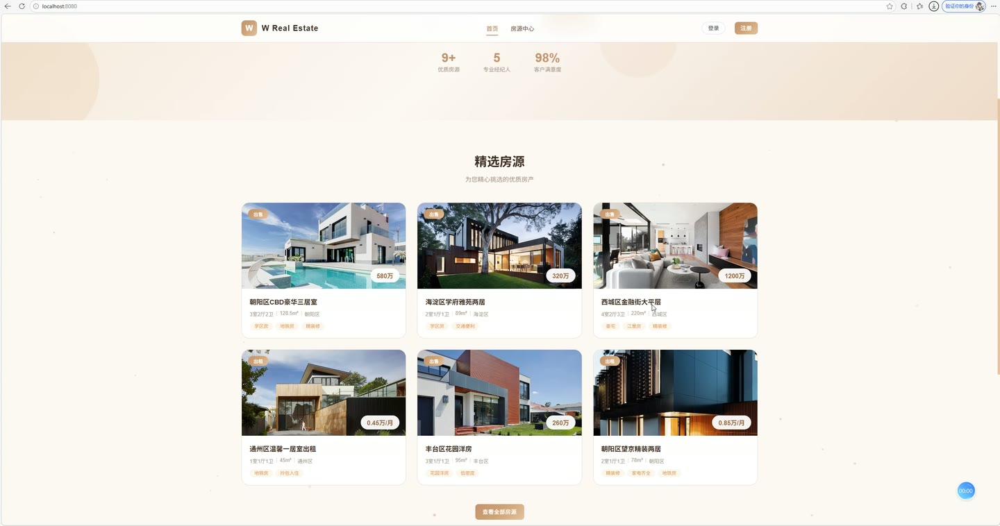
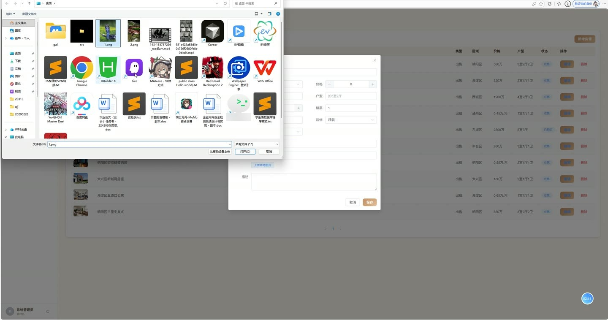
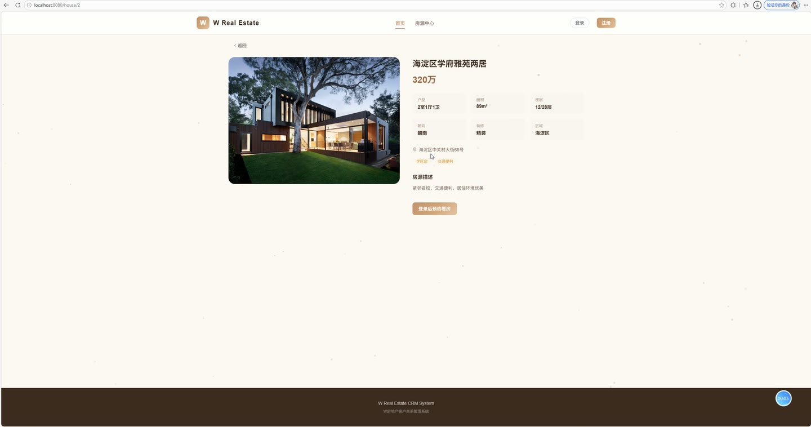
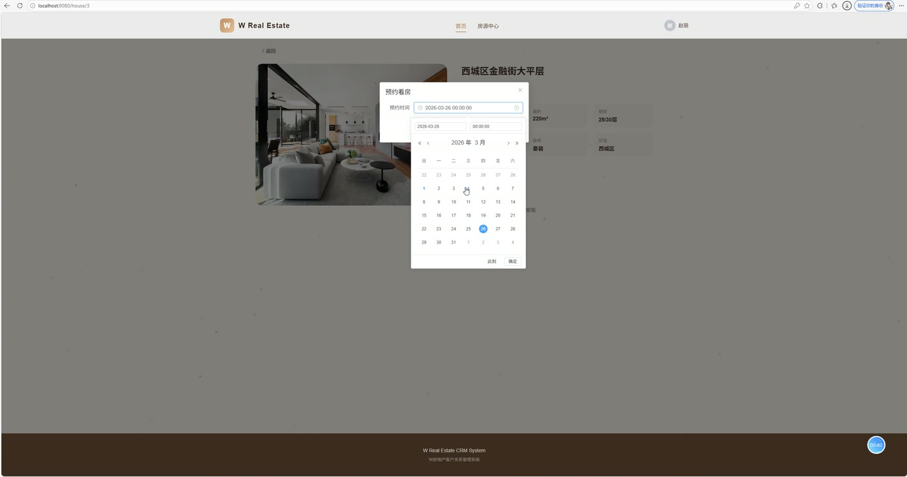
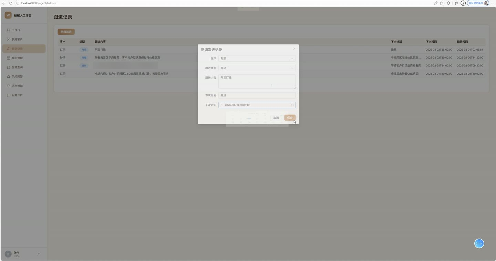
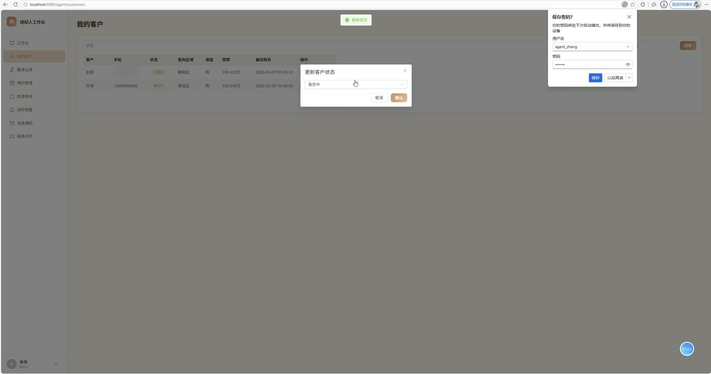

# (附文档)Springboot3+Vue3+MySQL 房地产公司客户关系管理系统

**技术栈**：Springboot3、Vue3、MySQL

### 系统简介

本系统是一套面向房地产行业的客户关系管理解决方案，采用前后端分离架构，包含普通用户端（客户端）、管理员端、经纪人端三个角色。系统围绕客户全生命周期管理，提供从客户获取、需求登记、经纪人分配、跟进记录、预约看房、服务评价到数据看板分析的一体化业务流程，帮助房地产企业有效管理客户资源、提升服务转化率。
 
### 核心功能
 
### 普通用户端

 
- 用户注册：填写用户名、密码、真实姓名、手机号、意向类型（购房/租房），注册成功后自动创建客户档案，来源标记为"线上" 
- 用户登录：输入用户名与密码进行身份验证，支持记住登录状态，登录后按角色跳转至对应工作台 
- 个人资料维护：查看并编辑个人基本信息，包括真实姓名、手机号、邮箱、头像等字段 
- 需求信息管理：查看自己的购房/租房需求档案，可修改预算区间（最低/最高）、意向区域、意向户型、意向类型及备注说明 
- 预约看房：选择房源提交看房预约，填写预约时间，系统自动关联当前客户及所属经纪人，初始状态为"待处理" 
- 我的预约列表：分页查看历史看房预约记录，包含房源标题、预约时间、处理状态，可对未处理的预约执行取消操作 
- 服务进度查询：实时查看个人客户档案的服务阶段状态，包括新客户、已联系、有意向、看房中、谈判中、已成交、售后、已流失 
- 服务记录查看：分页浏览经纪人对自己客户的跟进服务记录，包含跟进方式、内容、下次计划及时间 
- 评价与投诉：对经纪人服务进行评价，支持选择类型（好评/投诉）、填写内容、给出评分（1-5星），提交后状态为"待处理" 
- 我的评价列表：分页查看历史提交的评价与投诉记录及处理状态
 
### 管理员端

 
- 数据看板：展示总客户数、总房源数、经纪人数、待处理预警数四项核心指标 
- 客户状态分布图：以饼图展示各状态（新客户/已联系/有意向/看房中/谈判中/已成交/售后/已流失）的客户数量占比 
- 客户来源分析图：以柱状图展示线上、转介绍、到店、广告等不同来源的客户数量对比 
- 用户管理：分页查询系统用户列表，支持按角色筛选、按姓名或手机号模糊搜索，可新增、编辑、删除用户账号 
- 用户状态控制：创建用户时设置角色（管理员/经纪人/普通用户），支持启用或禁用账号，禁用后无法登录系统 
- 客户管理：分页查看全部客户档案，支持按客户状态筛选、按姓名或手机号搜索，展示客户来源、意向区域、意向类型、所属经纪人等信息 
- 客户分配：将未分配或需调整的客户重新指派给指定经纪人，支持从在职经纪人列表中选择 
- 房源管理：分页管理房源信息，支持按类型（出售/出租）、状态（在售/已预订/已售/下架）、标题关键词筛选 
- 房源增删改：新增房源时填写标题、类型、价格、区域、户型、面积、楼层、朝向、装修、地址、封面图、描述等完整字段，支持本地图片上传 
- 预警中心：分页查看系统预警列表，支持按状态（待处理/已处理/已忽略）筛选，展示预警类型（流失风险/未联系/跟进逾期）及关联客户和经纪人 
- 预警处理：对待处理预警执行"处理"或"忽略"操作，更新预警状态 
- 评价管理：分页查看全部客户评价与投诉记录，支持按类型（好评/投诉）筛选，展示评分、内容及处理状态 
- 经纪人列表：获取所有启用状态的经纪人列表，用于客户分配操作
 
### 经纪人端

 
- 工作台数据看板：展示我的客户数、待跟进（3天内需联系）、待处理预约数、待处理预警数、未读通知数 
- 我的客户状态分布：以图表形式展示名下客户各状态的数量分布情况 
- 客户管理：分页查看名下客户列表，支持按状态筛选、按姓名或手机号搜索，展示客户来源、意向信息及最后联系时间 
- 客户状态更新：修改名下客户的服务状态（如从"已联系"改为"有意向"），系统自动记录最后联系时间，成交时自动记录成交时间 
- 跟进记录管理：分页查看名下客户的跟进历史，支持按客户筛选，记录跟进方式、跟进内容、下一步计划及下次跟进时间 
- 新增跟进记录：选择客户、填写跟进方式与内容、设定下次跟进计划和时间，提交后自动更新客户最后联系时间 
- 预约管理：分页查看名下客户的看房预约，支持按状态（待处理/已完成/已取消）筛选，展示客户姓名、房源标题、预约时间 
- 预约处理：对待处理的预约进行状态更新，可标记为已完成并填写反馈和评分 
- 房源查询：查看当前在售/在租的房源列表，支持按类型、区域、关键词搜索，便于为客户推荐合适房源 
- 预警列表：分页查看分配给自己的客户预警，支持按状态筛选，可对待处理预警执行处理操作 
- 通知中心：分页查看系统通知消息，包含标题、内容、类型，支持将未读通知标记为已读 
- 评价查看：分页查看客户对自己的评价与投诉记录，包含评分、内容及处理状态
 
### 技术栈

  后端框架 Spring Boot 3.x   ORM MyBatis-Plus 3.5.x   权限认证 Spring Security + JWT（jjwt 0.12.x）   前端框架 Vue 3（Composition API + script setup）   前端路由 Vue Router 4（createWebHistory）   状态管理 Pinia（用户状态管理）   UI 组件库 Element Plus   图表库 ECharts 5   构建工具 Vite   数据库 MySQL 8.x   文件上传 Spring MultipartFile 本地存储 
 
### 交付内容

 
- 后端完整源码 
- 前端完整源码 
- 数据库初始化脚本 
- 万字文档

## 界面展示

---

## 获取完整源码 + 万字文档

本仓库为项目介绍页。**完整前后端源码、数据库初始化脚本、万字项目文档**，请加微信 `kangkangcode`，或访问 [codekk.top](http://codekk.top) 获取。

可作课程设计 / 毕业设计参考，支持远程部署调试。